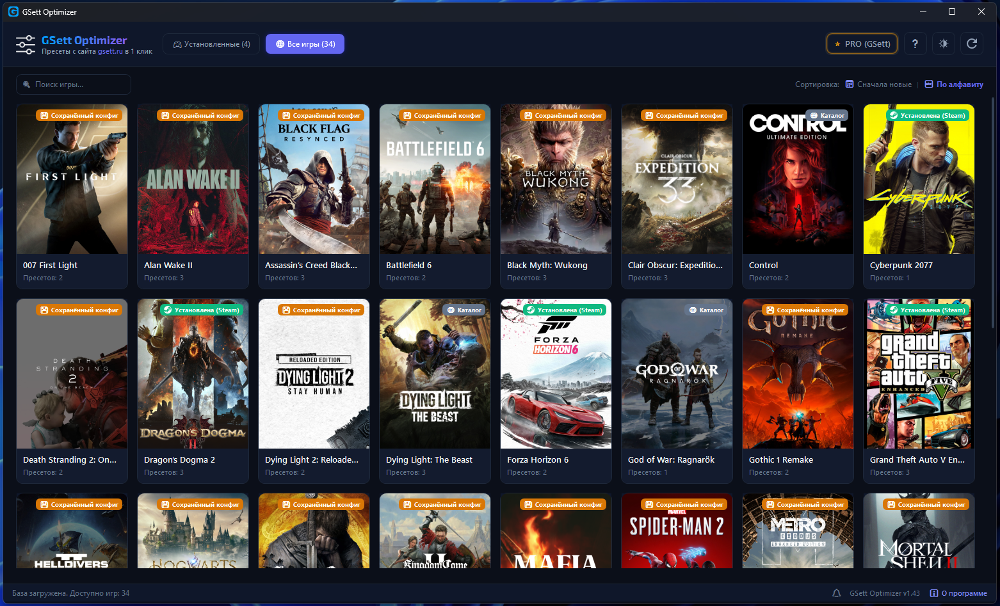
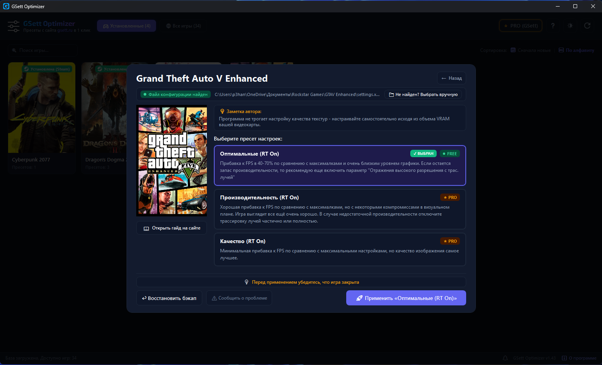
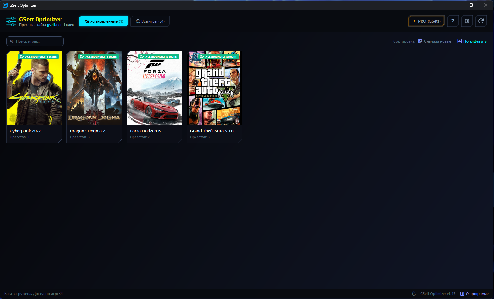
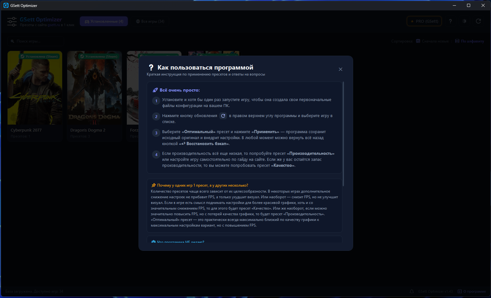

# 🎮 GSett Optimizer

**Программа для применения оптимальных настроек графики ПК-игр в один клик**

 

  <a href="#-быстрый-старт"><b>Скачать</b></a> •
  <a href="#-ключевые-возможности"><b>Возможности</b></a> •
  <a href="#%EF%B8%8F-безопасность-и-бэкапы"><b>Безопасность</b></a> •
  <a href="#-pro-версия"><b>PRO-версия</b></a> •
  <a href="#-faq--вопросы-и-ответы"><b>FAQ</b></a>

---

## 💡 О проекте

**GSett Optimizer** — это легковесное приложение для Windows, созданное для геймеров, которое позволяет применять пресеты оптимальных графических настроек с сайта `gsett.ru` в один клик, без необходимости выставлять параметры вручную.

Программа автоматически находит установленные игры, позволяет выбрать один из готовых пресетов настроек под разные цели и применяет их за секунду с автоматическим созданием резервной копии.

---

## ✨ Ключевые возможности

* 🚀 **Применение пресетов в 1 клик:**
  * **Оптимальный**: наилучший баланс - вы получаете очень близкое качество графики к максимальным настройкам, но с гораздо более высоким FPS.
  * **Производительность***: более существенный прирост к FPS, но уже с некоторыми визуальными компромиссами. Рекомендуется использовать, если при Оптимальном пресете FPS недостаточный.
  * **Качество***: наилучшее качество графики, но уже не с таким большим приростом FPS как при Оптимальном пресете. Рекомендуется использовать, если с Оптимальным пресетом все ещё остаётся запас производительности.
  > \* *Дополнительные пресеты Качество и Призводительность доступны в **<a href="#-pro-версия"><b>PRO-версии</b></a>***.
* 🔍 **Автоопределение установленных игр:**
  * Автоматический поиск установленных игр из библиотеки **Steam** и некоторых других лаунчеров, в том числе торрент-версий.
  * Автоматический поиск пути к файлу настроек игры (`%LOCALAPPDATA%`, `Documents`, `Saved Games`, Windows Registry и т.д.).
* 🛡️ **100% Безопасность и автоматические бэкапы:**
  * Перед любым изменением создаётся точный бэкап оригинального конфига.
  * Кнопка **«Восстановить бэкап»** доступна в любой момент в карточке игры.
  * Защита от случайного применения при запущенной игре.
* 🌐 **Облачная база пресетов:**
  * Каталог игр и конфигураций синхронизируется с сервером `gsett.ru` в реальном времени.
  * Новые игры автоматически появляются в программе без необходимости её обновления.
* 🎨 **Цветовые темы оформления:**
  * 6 разных тем оформления (в бесплатной версии доступна только стандартная тема).
* 📦 **Автономность:**
  * Один единственный `.exe` файл (~71 МБ).
  * Формат Portable - нет необходимости устанавливать программу.
  * Возможность работы без подключения к интернету (но для первичной загрузки базы игр и пресетов с сервера требуется подключение).

## ❗ Что программа НЕ делает:
* Программа не подбирает настройки под конкретно ваше железо. Она только применяет пресеты оптимальных настроек, которые являются универсальными и подбираются таким образом, чтобы игра выглядела максимально близко по качеству к максимальным настройкам, но с более высоким FPS.
* Также, программа НЕ затрагивает настройки качества текстур, апскейлеров, разрешения экрана, генерации кадров и т.п. Так как это нужно настраивать каждому пользователю самостоятельно исходя из его оборудования и личных предпочтений.
* Различные эффекты постобработки (размытие в движении, хроматическая аберрация, глубина резкости, виньетка и т.п.) программа меняет только в том случае, если эти параметры сказываются на производительности. В любом случае лучше настроить их самостоятельно на свой вкус после применения пресета.
* Программа не затрагивает дополнительные или скрытые настройки игровых движком. Она меняет только графические настройки, доступные внутри игры.

---

## 📸 Скриншоты интерфейса

| Главное окно и каталог игр | Карточка игры и выбор пресета |
|:---:|:---:|
|  |  |

| Тема «Киберпанк» | Окно помощи |
|:---:|:---:|
|  |  |

---

## 🛡️ Безопасность и бэкапы

Программа полностью безопасна для вашей системы, аккаунтов и игровых файлов:

1. **Никаких инжектов и вмешательства в память:**
   * Программа **НЕ** внедряется в память процессов, **НЕ** изменяет `.exe` или вообще какие-либо файлы игр.
   * Оптимизируются только официальные пользовательские файлы конфигураций (`settings.json`, `Config.ini`, `Engine.ini`, `UserOptions.ini` и др.).
2. **Не вызывает банов в античитах:**
   * Изменение параметров графических настроек через конфиги разрешено разработчиками игр.
3. **Резервная копия перед каждым применением:**
   * Оригинал всегда сохраняется в папку бэкапов с датой и временем.
   * Если вам не понравился результат — нажмите кнопку «Восстановить» и вернитесь к исходным настройкам за долю секунды.

---

## 💎 PRO-версия

Проект развивается при поддержке сообщества на [Boosty](https://boosty.to/gsett/). Оформив подписку от уровня MEDIUM (100₽) и выше, вы получаете доступ к PRO-версии:

* **Дополнительные пресеты:** помимо Оптимального пресета, вы также сможете применять пресеты Производительность и Качество
* **Игры из сторонних лаунчеров:** вы получите доступ к применению пресетов не только к играм из Steam, но и с других лаунчеров, в том числе торрент-версий
* **Ранний доступ** к новым играм и пресетам раньше всех
* **Дополнительные темы оформления:** вы получите доступ к 5 дополнительным цветовым темам
* **Отключение промо-баннера**, если он когда-то будет =)

Как получить доступ к PRO-версии программы:
* Перейдите на страницу [Boosty](https://boosty.to/gsett/) и оформите платную подписку уровня MEDIUM (100₽) или выше
* В программе в левом верхнем углу нажмите кнопку "Активировать PRO" и введите в поле своё имя на Boosty. Ваше имя можно посмотреть в настройках аккаунта Boosty: [boosty.to/app/settings/edit](https://boosty.to/app/settings/edit)
* Если активация не срабатывает - подождите пару минут и попробуйте снова, т.к. добавление лицензий в базу происходит не моментально. И убедитесь что вы вводите имя точно также, как оно указано в вашем профиле Boosty.
* Если в вашем профиле Boosty не было указано никакое имя при регистрации, то активировать лицензию PRO можно также по вашему email. Но информация об email платных подписчиков вносится в базу раз в сутки, поэтому активировать PRO таким образом сразу после оформления платной подписки не получится. Для ускорения процесса вы можете написать мне в личку на Boosty или в личку [TG](https://telegram.me/katar5yz)

---

## 📥 Быстрый старт

### Системные требования:
* **Операционная система:** Windows 10 / Windows 11 (64-bit)
* **Интернет:** требуется для первой загрузки базы игр и обложек
* **Права:** права администратора **не требуются** (программа безопасно работает с пользовательскими профилями `AppData`, `Documents` и веткой реестра `HKEY_CURRENT_USER` без вызова UAC).

### Установка:
1. Перейдите на страницу **[Releases](../../releases/latest)**.
2. Скачайте файл **`GSettOptimizer.exe`** в любое удобное место на диске.
3. Запустите программу (установка не требуется) и дождитесь загрузки базы игр и пресетов.
4. Выберите игру из каталога, нажмите на нужный пресет и нажмите **«Применить»**
**Важные примечания:**  для успешного применения пресета игра должна быть в этот момент закрыта. Также, если программа не видит конфиг игры, убедитесь что вы запускали эту игру хотя бы 1 раз, т.к. конфигурационные файлы на вашем диске игры создают первый раз только после запуска.

---

## ❓ FAQ / Вопросы и ответы

<b>Безопасно ли использовать программу? Не забанят ли меня?</b>

 
Да, абсолютно безопасно. GSett Optimizer работает исключительно с разрешёнными текстовыми конфигурационными файлами, предназначенными для пользовательских настроек графики. Программа не модифицирует исполняемые файлы игры и не вмешивается в память, поэтому античиты (VAC, Easy Anti-Cheat, BattlEye и др.) не реагируют на эти изменения. По сути, это тоже самое, что поменять настройки внутри игры

<b>Как вернуть мои прежние настройки, если что-то пошло не так?</b>

 
В карточке каждой игры есть кнопка <b>«Восстановить бэкап»</b>. Программа автоматически сохраняет исходный файл конфигурации до применения любых изменений. Одно нажатие — и ваши прежние настройки на месте.

<b>Что делать, если игра установлена, но программа пишет, что файл не найден?</b>

 
Большинство современных игр создают конфигурационный файл только после своего первого запуска. Достаточно запустить игру хотя бы 1 раз, дойти до главного меню, закрыть её и снова нажать «Обновить» в GSett Optimizer. Также в карточке игры можно указать путь к конфигу вручную. Также у некоторых версий игр (например с торрентов или сторонних лаунчеров) путь к конфигурационному файлу может отличаться и программа его попросту не знает. В таких случаях просьба нажать кнопку "Сообщить о проблеме" в карточке игры и указать из какого лаунчера у вас игра.

<b>Будет ли работать программа на Steam OS/Linux?</b>

 
Нет! Программа работает только на Windows 10/11. Даже если вы её запустите под Linux, она не сможет применять пресеты, т.к. там конфигурационные файлы игр и пути к ним отличаются. 

---

## 🤝 Обратная связь и сообщество

* 🌐 **Сайт:** [gsett.ru](https://gsett.ru)
* 🧡 **Поддержка на Boosty:** [boosty.to/gsett](https://boosty.to/gsett/)
* 📢 **Telegram-канал:** [t.me/gsett_ru](https://t.me/gsett_ru)
* 🐛 **Сообщить об ошибке:** [GitHub Issues](../../issues) или мне в личку в [TG](https://telegram.me/katar5yz)

